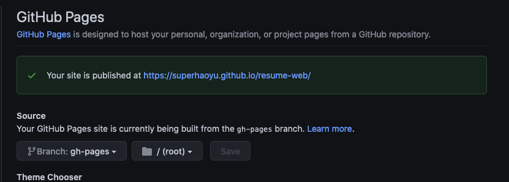

## Build React Personal Resume with React App and publish to Github as static Web

This assumes you already installed Node and NPM

To start, clone this project by

```
git clone https://github.com/superhaoyu/resume-web.git 
cd resume-web
```

Then run npm install to create dependencies and node_modules
```
npm install
```

To launch this project locally, run the following
```
npm start
```

At this moment, you should have launched a succssfuly webpage like 


Back to the terminal, let’s install a package that will create a gh-pages branch on GitHub.

```
npm install gh-pages
```

After that, open the package.json file in your root directory and add this line of code at the top level.

```
"homepage": "https://username.github.io/repository-name"
```
React uses the homepage property to determine the root URL of your app in production.

Modify the above URL to include your GitHub username and repository name. In my case, the `package.json` file now looks like this:

```
  "name": "resume-web",
  "homepage": "https://superhaoyu.github.io/resume-web",
  "version": "0.1.0",
  "private": true,
```

Still in the `package.json` file. Locate the scripts property and only add these lines of code if missing 

```
"scripts": {
"start": "react-scripts start",
"build": "react-scripts build",
"test": "react-scripts test",
"eject": "react-scripts eject",
"predeploy": "npm run build",
"deploy": "gh-pages -d build"
},
```

Save the file. Lastly, run this command to push your file to the gh-pages:

```
npm run deploy
```

This command will create a `build` folder in the root directory. This folder will contain production-ready files that will be deployed. And once you have a success, you can visit the URL you assigned to the homepage property in the `package.json` file and see your application.

Alternatively, you can go back to your GitHub repository and click on the Settings tab. Then scroll down to GitHub pages section to see the URL.


